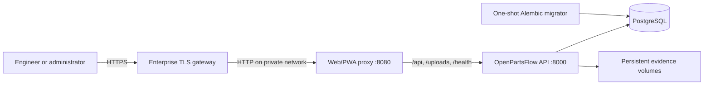

# OpenPartsFlow private deployment

This is the production path for a single-site, customer-managed OpenPartsFlow
installation. Local `docker-compose.yml`, SQLite, source mounts, and the reload
server remain development-only.

## Architecture and trust boundaries



Only `web:8080` is published by Compose. PostgreSQL has no host port and is on
an internal data network. The API is reachable only by the web proxy and may
make outbound integration calls. Public uploads, protected knowledge media,
and restore rollback evidence use three distinct persistent volumes.

The API and web containers run as non-root users with all Linux capabilities
dropped, `no-new-privileges`, and read-only root filesystems. `/tmp` and the
three explicitly mounted evidence locations are the only runtime write paths.
Local JSON logs rotate at 10 MB with five files per service; forward them to the
customer's protected centralized log system for durable retention.

## Host requirements

- Linux host or managed container VM supported by Docker Engine 27+ and Docker
  Compose v2.20+.
- At least 4 GB RAM and sufficient encrypted storage for the database, uploads,
  exports, and restore rollback evidence.
- A TLS-terminating gateway/load balancer. Do not expose port 8080 directly to
  an untrusted network.
- DNS and a valid certificate for `FRONTEND_PUBLIC_URL`.
- An infrastructure backup target outside the Docker host.

## Configure secrets

Copy the template and restrict it to the deployment administrator:

```bash
cp .env.production.example .env.production
chmod 600 .env.production
python -c "import secrets; print(secrets.token_urlsafe(48))"
```

Replace every `CHANGE_ME` value. Use the same URL-encoded database password in
`POSTGRES_PASSWORD` and `DATABASE_URL`. `IMAGE_TAG` must be an immutable release
or commit identifier, and `VCS_REF` must be the full source commit SHA.

Important configuration rules:

- Production and staging require PostgreSQL; SQLite is rejected.
- `JWT_SECRET_KEY` must be a non-placeholder secret of at least 32 characters.
- `FRONTEND_PUBLIC_URL` and every CORS origin must be an exact HTTPS origin.
- Production CORS never inherits localhost development origins.
- Public, private, and rollback storage roots must be absolute and distinct.
- `RBAC_ENFORCE=true` and `LEGACY_HEADER_AUTH=false` are forced outside tests.
- Leave `PUBLIC_API_BASE_URL=/api` for the same-origin proxy topology.

The `.env.production` file is git-ignored. Keep a protected copy in the
customer's secret manager; never attach it to tickets, logs, or backups.

## Validate, build, and start

All commands run from the repository root:

```bash
export OPENPARTSFLOW_ENV_FILE=.env.production
docker compose --env-file .env.production -f docker-compose.production.yml config --quiet
docker compose --env-file .env.production -f docker-compose.production.yml build --pull
docker compose --env-file .env.production -f docker-compose.production.yml run --rm --no-deps migrate python -m scripts.validate_production_config
docker compose --env-file .env.production -f docker-compose.production.yml up -d
```

Compose waits for PostgreSQL, runs `alembic upgrade head` exactly once, waits
for API readiness, and then starts the web proxy. The API itself never mutates
the database schema during startup.

Verify the deployment before admitting users:

```bash
docker compose --env-file .env.production -f docker-compose.production.yml ps
curl --fail http://127.0.0.1:8080/health/live
curl --fail http://127.0.0.1:8080/health/ready
docker compose --env-file .env.production -f docker-compose.production.yml logs --no-log-prefix migrate api web
```

Repeat the probes through the public HTTPS hostname. A ready response requires
both a reachable database and the exact Alembic head. Worker health may report
`degraded` without changing core readiness; investigate it in Platform
Operations before sign-off.

## Upgrade procedure

1. Record the current `IMAGE_TAG`, `VCS_REF`, schema revision, and health output.
2. Take and verify database plus evidence-volume backups.
3. Fetch the reviewed release commit and set a new immutable image tag/SHA.
4. Build both images.
5. Run the production configuration validator.
6. Stop user writes at the gateway for the migration window.
7. Run the migrator explicitly and require exit code zero.
8. Recreate API/web, restore traffic, then verify health and a read-only workflow.

```bash
docker compose --env-file .env.production -f docker-compose.production.yml build --pull
docker compose --env-file .env.production -f docker-compose.production.yml run --rm migrate
docker compose --env-file .env.production -f docker-compose.production.yml up -d --remove-orphans
```

Never reuse a release tag for different code. The current application contains
in-process integration and billing schedulers, so this topology intentionally
runs one API replica. Horizontal API scaling first requires moving scheduled
workers to separately leased worker processes.

## Backup and restore controls

Back up all four durable data sets as one recovery point:

- PostgreSQL (`postgres_data`) using a consistent `pg_dump`/snapshot.
- Public evidence (`uploads`).
- Protected evidence (`private_uploads`).
- Restore rollback evidence (`restore_rollbacks`).

Also create a password-confirmed organization export from OpenPartsFlow and
retain its manifest and SHA-256 as an application-level recovery artifact.
Infrastructure backups must be encrypted, access-controlled, copied off-host,
and tested by restoring into an isolated environment. Record measured RPO/RTO.

Do not restore a volume snapshot independently from its database recovery point:
database references and evidence files must remain consistent.

## Rollback and incident isolation

If a release fails before migration, switch the immutable image tag back and
recreate API/web. If migration already ran, do not point older code at the newer
schema. Keep the gateway closed, preserve logs/evidence, and restore the complete
pre-change recovery point or execute a separately rehearsed Alembic downgrade.

For suspected compromise:

1. Remove public ingress without deleting containers or volumes.
2. Rotate JWT, database, webhook, API-key, and external-integration secrets.
3. Preserve audit logs, database snapshot, image digests, and container logs.
4. Restore into an isolated network and validate schema/readiness.
5. Reopen only after tenant access, ownership, and custody checks pass.

## Known boundaries

- TLS, WAF/rate limiting, centralized log retention, host patching, and volume
  encryption belong to the customer infrastructure layer.
- Compose provides single-host availability, not multi-host failover.
- Named volumes are persistent but are not backups.
- Object storage and external worker leasing are future scale-out changes.
